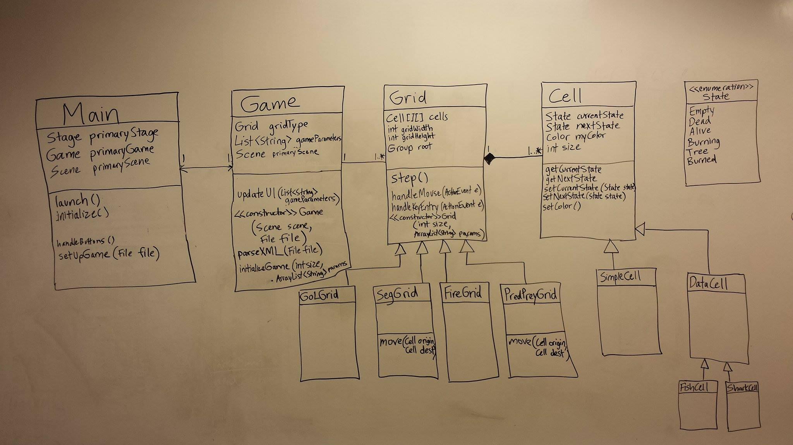
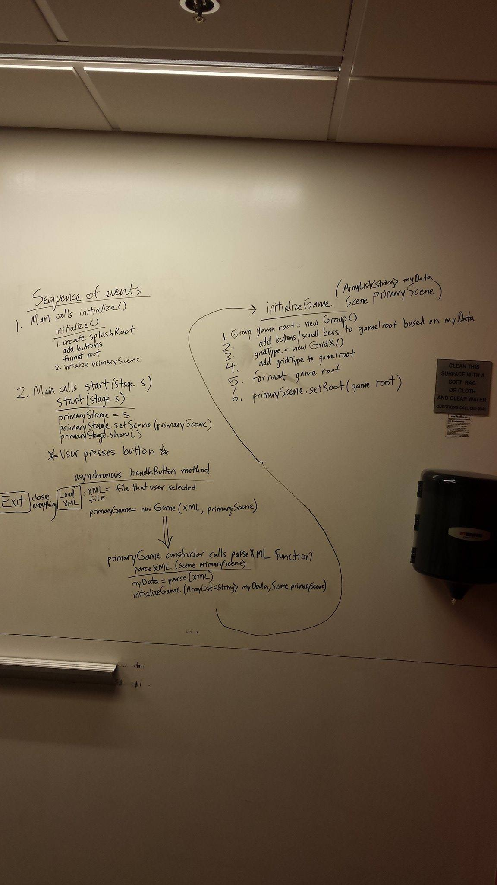
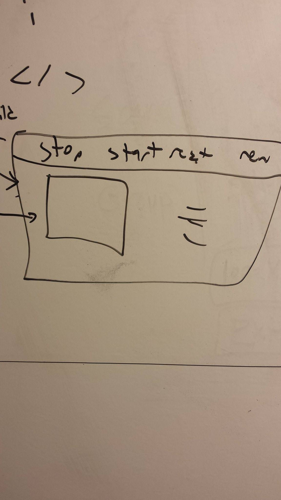

CompSci 308: Cell Society Design
===================

> This is the link to the Design Description: [Plan - Cell Society](http://www.cs.duke.edu/courses/compsci308/spring16/assign/02_cellsociety/part1.php)

### Introduction
The goal of this project is to create a program that runs multiple different types of Cellular Automata and displays it graphically. Our program will be flexible enough to deal with all the CAs specified in the assignment description.  Our code should be able to add even more types of CAs if needed.

The basic architecture of our program is as follows. There's a UI that will allow you to load in an XML file. Once that is loaded in, depending on the type of CA the XML file describes, the program creates a grid filled with cells that follow the rules of CA.

### Overview

The way we structured our program, Main simply launches the application and also allows you to read in an XML file or exit the program. When you load an XML file it will create a Game object, pass the file and scene to it. The constructor of Game will then parse the XML file. When the XML file is parsed, it will initialize the game with the Scene and some data structure that holds the rules for the CA which we parsed from the XML file. When the Game is initialized, a new Grid is made based on the which CA the XML file specifies. The specific Grid will change the UI with information relevant to it. The Grid updates by calling the step() function. The Grid class itself is an abstract super class and each specific Grid extends it. The way they implement step() is specific to the rules of the CA. The Grid is populated by Cell objects. There are two major Cell subclasses, SimpleCell and DataCell. SimpleCells simply exist in one of the states listed in the enumeration class State. DataCells on the other hand have persistent information that needs to be tracked.  

### User Interface
Users will load an XML file with the specifications for the CA. Once the file is loaded, they will be able to step through the CA or run it continuously and stop whenever they want. They can then exit that CA and load another XML file to run a different one. When a CA is chosen, the application will display all pertinent information as well as the visuals of the simulation. There will be buttons to step, start, and reset the CA. If an error occurs, an error window will pop-up giving the explanation for what happened.

### Design Details
* Describe components in detail, including extra sub-components
* For each component: how it handles specific features, what resources it uses, how it collaborates with others, how it can be extended
* Steps needed to complete use cases
* Justify the decision to create each component with respect to design's key goals/principles/abstractions

### Design Considerations
* Describe pros and cons of design decisions made
* Describe design issues that need to be addressed
* Assumptions or dependencies that impact overall design

### Team Responsibilities
We've decided to split the work into two parts. One person will be responsible for dealing with the interactions between and implementing the Game, Grid, and Cell class. The second half of the work will be split between two people. Each of those people will work on implementing the specific Grid types that follow rules of the CAs. They'll each do two each as there are four.
